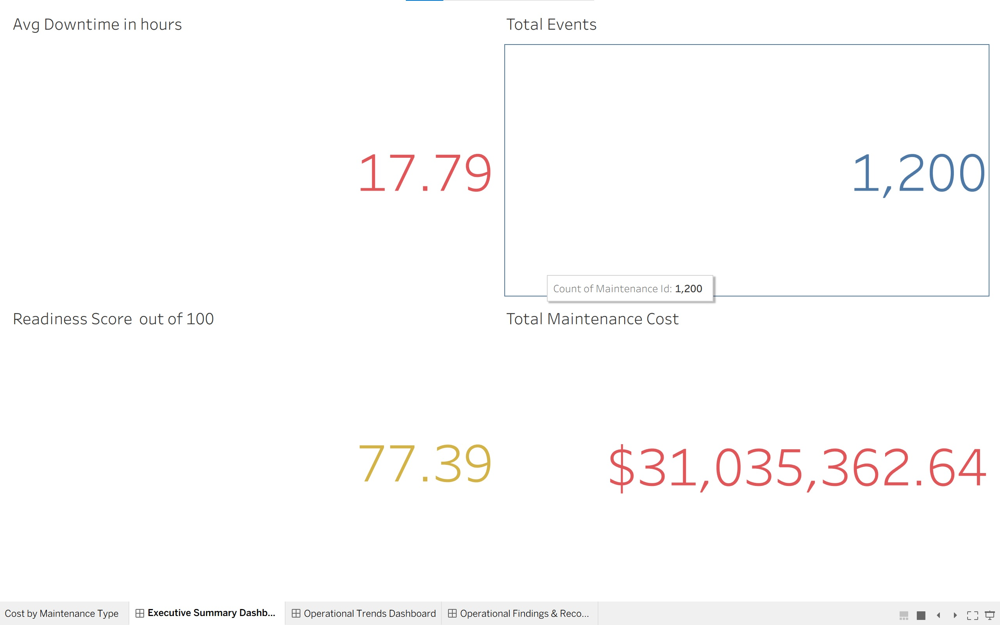
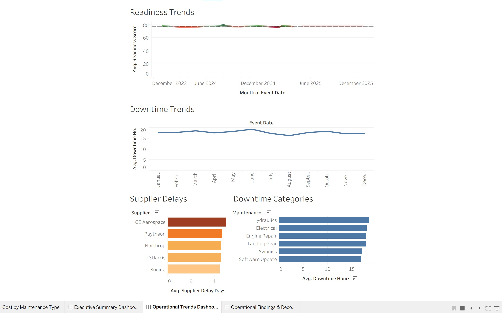

# ✈️ Aviation Operational Readiness & Sustainment Analytics

### End-to-End Maintenance Analytics | Python · SQL · Tableau · Excel

---

## Overview

This project analyzes aviation maintenance operations, supplier performance, and operational readiness metrics across multiple bases to identify performance risks, downtime trends, and process improvement opportunities.

The analysis follows an end-to-end workflow: raw maintenance data was cleaned and transformed in Python, queried in SQL for pattern identification, and visualized in interactive Tableau dashboards for KPI reporting and executive communication.

> **Business Question:** *Which maintenance categories, suppliers, and operational conditions drive the greatest risk to aviation readiness — and what interventions will reduce them?*

---

## Tools Used

| Phase     | Tool            | Purpose                                                          |
|-----------|-----------------|------------------------------------------------------------------|
| Clean     | Python (pandas) | Data validation, cleaning, and feature engineering               |
| Analyze   | SQL             | Aggregations, root cause analysis, and trend identification      |
| Visualize | Tableau         | Interactive KPI dashboards and operational trend reporting       |
| Report    | Excel           | Supporting data exploration and summary outputs                  |

---

## Key Findings

- 🔧 **Engine Repair and Hydraulics generated the longest average downtime** across all aircraft types, both exceeding 18 hours per event — making them the highest-priority categories for preventative scheduling
- 🚚 **Select suppliers were strongly correlated with lower readiness scores** and increased maintenance backlog, indicating concentrated vendor risk
- 📉 **Operational readiness scores declined during periods of elevated maintenance activity**, suggesting insufficient resource buffering during high-demand periods
- 🏭 **Base-level analysis revealed geographic variation in risk concentration**, with certain locations disproportionately affected by recurring downtime categories

---

## Recommendations

1. **Increase preventative maintenance scheduling** for Engine Repair and Hydraulics categories to reduce unplanned downtime and operational disruption.
2. **Review supplier escalation and inventory management procedures** for vendors exceeding average delay thresholds — establish performance benchmarks and contingency sourcing.
3. **Implement automated KPI monitoring dashboards** to surface readiness risks earlier and improve sustainment response times across all bases.
4. **Prioritize resource allocation during historically high-maintenance periods** to stabilize readiness performance and reduce backlog accumulation.

---

## Dashboards

📊 [View the Interactive Tableau Dashboards](https://public.tableau.com/views/aviation_maintenance_dashboards/OperationalTrendsDashboard?:language=en-US&:sid=&:redirect=auth&:display_count=n&:origin=viz_share_link)

The published workbook includes three dashboard views:

**Executive Summary** — Average downtime, total maintenance events, readiness score, and total maintenance cost at a glance.

**Operational Trends** — Readiness trends over time, downtime trends by category, supplier delay analysis, and downtime category breakdown.

**KPI Reporting** — Interactive filters for base, aircraft type, and time period to support targeted operational review.

| KPI Dashboard | Operational Trends |
|---|---|
|  |  |

---

## Repository Structure

```
aviation_sustainment_analytics/
├── aviation_maintenance_dataset.csv          # Raw source dataset
├── aviation_maintenance_cleaned.xls.xlsx     # Cleaned dataset (Excel output)
├── aviation_maintenance_sql_project.sql      # SQL queries for analysis
├── kpi_dashboard.jpg                         # KPI dashboard screenshot
├── operational_trends_dashboard.jpg          # Operational trends dashboard screenshot
└── README.md
```

---

## Data

The dataset contains aviation maintenance records including aircraft type, maintenance category, downtime duration, supplier information, base location, readiness scores, and maintenance cost. All data is simulated for analytical demonstration purposes.

---

## Contact

*Jace Cordell — [GitHub](https://github.com/jcordell0414) · [LinkedIn](https://www.linkedin.com/in/jcordell0414)*
